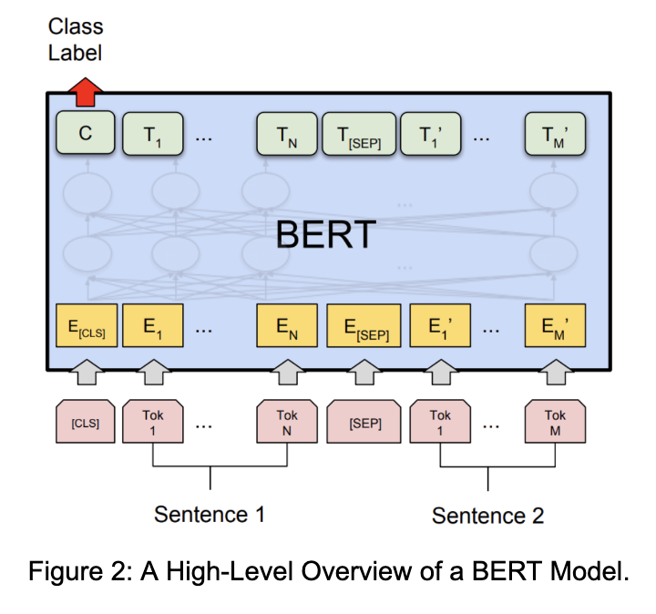
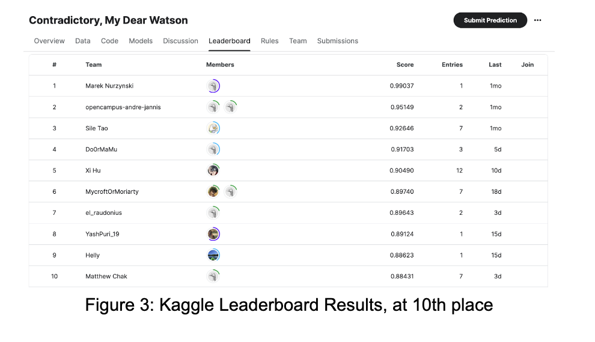

# Deep-Learning-Projects
#### Python, Keras, Tensorflow

## Covered Material:
Epoch Training, Gradient Descent Implementation (Gradient Descent, Mini-Batch, Stochastic), Image Vectorization, One-Hot Encoding, CNN processing with CIFAR-10 Dataset, Using RNN's to generate text based on seed input, Target Image stylized with Style-Reference Image using VGG19, GAN's

## Final Project:
### Ilógico
#### Authors: Matthew Chak, Jerry Chang, Kyle Bistrain
#### Under Guidance of: Dr. Assal
#### CSC 487: Deep Learning, Cal Poly SLO

## Project Description

Throughout our daily lives, we must communicate to achieve our goals and navigate our environments. Such a task is simple to humans, as we are deeply social and have had this skill ingrained within us from the moment we are born. However, as it turns out, the more basic a social skill is for humans, the more complex it may be to replicate in our own creations. Machines have been employed for decades to solve NLP challenges, making slow but steady breakthroughs. The problem is not a trivial one for proof of concept either, as companies are looking for ways to automate sentiment analysis tasks to better understand customer desires and feedback without the use of tedious human interpretation. Such exploration has become both a lucrative and an imperative endeavor, so it is clear to see why efforts are so focused on Sentiment Analysis. In our project, we have opted to trial our own learned knowledge over the course of the quarter by employing it in a sentiment analysis neural network model to the best of our abilities.

In our project, we classify text pairs into logical categories. Given two natural language sentences, our neural net determines the logical relationship between those two sentences. The text pairs may have the following relationships: the first entails the second, the two are contradictory, and the two have no relation (neutral). Our project thus combines natural language processing and classification, which are two very prominent subfields of artificial intelligence.

## Project Design

To implement our goal, we ended up using fine-tuned BERT architecture (more specifically, we found that the XLM-RoBERTa model worked best for our task). XLM-RoBERTa is a BERT trained on 2.5TB of data spanning 100 different languages, which made it quite useful for our project. 

We chose BERT-based architectures due to the sheer performance advantages of transformer-based models with NLP. The XLM-RoBERTa, like other BERT architectures, is composed of a stack of transformers. The computational complexity of these layers scale linearly to the representation dimension, while recurrent and convolutional layers scale quadratically. Utilizing Transformers yields less computational time complexity for NLP tasks when compared to CNN and RNN architectures, as asserted in “Attention Is All You Need” [2]. This allows for more parallelized computations and helps achieve higher accuracy.

The data is sourced from a Kaggle Competition [4], Contradictory, My Dear Watson [4], as two CSV files, one training and one test. The CSV files themselves consist of a table each of 6 data columns. The samples of Tensor features, comprises the following fields: id, premise, hypothesis, language abbreviation, language, and label. The id field is a unique integer identification number for entries within the table. The premise and hypothesis fields are string values of text, which serves as the primary data to determine how the hypothesis relates to the premise. The pair can be related, as one could entail the other, one could contradict the other, or they could be unrelated. The label field is of possible integer values 0, 1, 2 that describe the relationship between the premise and hypothesis (0 for entailment, 1 for neutral, 2 for contradiction). Language abbreviation and language are essentially the same information, and one of the two columns may be dropped in the interest of cleaner organization.

![Figure 1: Time Complexity for Neural Network Layers [2]](Figure1.png)

## Implementation

First, we translated all of our data to English with Google Translate (we note that though XLM-RoBERTa is multilingual, it does perform better on English sentences, so translating first boosted performance even though the translations were imperfect). Then, we fine-tuned the XLM-RoBERTa model using the translated premise-hypothesis pairs. We also split some samples off the training dataset to refine hyper-parameters. After fine-tuning, we tested the model on the test dataset.

We have also utilized Kaggle’s built in notebook to train and test our models. For training and model construction, we initially used Tensorflow, though our final notebook used Pytorch. 

## Testing

We used the test.csv file provided in the Kaggle CSV to test our network accuracy. The accuracy metric we tested against is the proportion of correctly classified sentiments. Thus, the higher the accuracy, the more text-pairs have been correctly classified as contradiction, entailment, or neither. Our task at hand did not have anticipated edge cases as a recognition problem would, but did have to accommodate the use of many languages in the test set. These languages were accounted for in the training dataset to have a representative model for the sentiment analysis of test text pairs.
After fine-tuning our model for performance, we submitted our model for evaluation on Kaggle’s competition page to test the accuracy of our model against a greater set of hidden data on the other end. 

## Conclusions and Analysis

In the end, we were able to fine-tune our model to perform at 88.43% accuracy, a significant improvement upon our initial naive attempt at 62% accuracy with a less robust NLP model. We noticed that the XLM-RoBERTa model significantly outperformed other open-source BERT architectures (e.g. BERT, BERT large, BERT Large English on the translated dataset, and a few more). It also significantly outperformed a naive RNN/LSTM attempt - though LSTMs do make sense in this context, there was simply not enough data to train a robust LSTM on such a complex task, and transformer architectures make more sense for NLP tasks like this anyways (in fact, the BERT architecture plays very nicely with our two-sentence structure due to how the pretraining step works). To boost our accuracy, we tuned hyperparameters on top of the pretrained model. Specifically, we dropped the learning rate by a factor of 5 to 1x10-5.

Pre-trained BERT architectures also contain a lot of predictive power that allow fine-tuning on a much smaller parameter set than would be needed to fully train an LSTM/transformer from scratch. By utilizing transfer learning, we were thus able to significantly decrease the amount of time needed to train our model.

Interestingly, although XLM-RoBERTa is a multilingual model, we noticed that translating everything to English first produced better results than keeping the multilingual setup. This is likely because the dataset that XLM-RoBERTa was originally trained on was predominantly English, so it performs better on English tasks than on some of the less common languages found in our dataset. 

As for extensions, ensemble methods might be an interesting try. We were also considering using LoRA to fine-tune the BERT models, which we think would probably yield fairly good results. Future work could also extend the dataset by finding more examples of premises and hypotheses.

## Future Work

For future development, we can expand our dataset with other datasets that share the features in our training and testing set. The classes of relationships may also be expanded to develop a more elegant model, one that is sensitive to greater nuance and subtext as human language demonstrates. In doing so, we would need to reevaluate our initial approach in this model development to try out further data organization and preparation, as well as layer-level transformations. Another interesting development could be the use of longer strings of texts and text samples that contradict or entail within a single, more complex sentence. 

## Work Cited
[1] A. Vaswani et al., “Attention Is All You Need,” arXiv.org, Jun. 12, 2017. https://arxiv.org/abs/1706.03762

[2] Cameron Hashemi-Pour, “What is BERT (Language Model) and How Does It Work?,” SearchEnterpriseAI. https://www.techtarget.com/searchenterpriseai/definition/BERT-language-model#:~:text=BERT%2C%20which%20stands%20for%20Bidirectional

[3] Conneau, Alexis, et al. “Unsupervised Cross-Lingual Representation Learning at Scale.” arXiv.Org, 8 Apr. 2020, https://arxiv.org/abs/1911.02116. Accessed 10 Mar. 2024. 

[4] “Contradictory, my dear Watson,” Kaggle, https://www.kaggle.com/competitions/contradictory-my-dear-watson/overview (accessed Mar. 10, 2024). 

[5] Rani Horev, “BERT Explained: State of the art language model for NLP,” Medium, Nov. 10, 2018.https://towardsdatascience.com/bert-explained-state-of-the-art-language-model-for-nlp-f8b21a9b6270

[6] Shivam Solanki, “What is sentiment analysis? IBM, October 25, 2022 https://www.ibm.com/topics/sentiment-analysis
‌

‌

‌

‌

